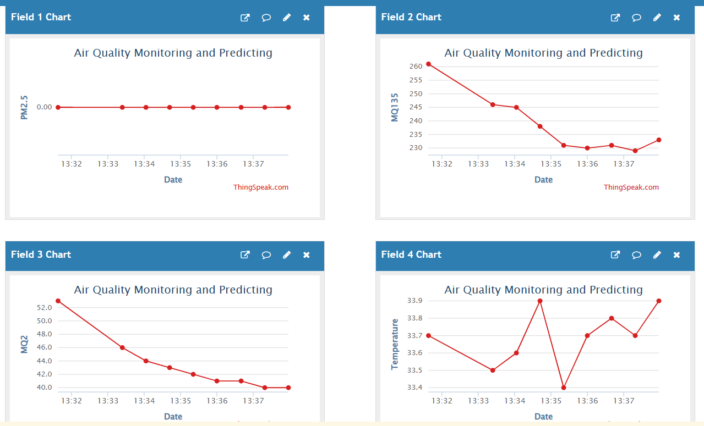

<h1>🌿 Indoor Air Quality Monitoring & Prediction 🌿</h1>

<strong>A Full-Stack IoT & ML Solution using Sensors, GSM, ThingSpeak, and Web Technologies</strong>

<h4>
<a href="#about-the-project">About</a> ·
<a href="#system-overview">System Overview</a> ·
<a href="#tech-stack">Tech Stack</a> ·
<a href="#features">Features</a> ·
<a href="#machine-learning-performance">ML Performance</a> ·
<a href="#screenshots">Screenshots</a> ·
<a href="#project-download">Download</a>
</h4>

<small>Developed by <strong>Aakash D</strong> | Final Year B.E. (ECE), Kingston Engineering College, 2024–2025</small>

---

## 📘 About the Project

This project addresses the growing concern of **indoor air pollution** by building a real-time monitoring and prediction system.

It collects sensor data via an **Arduino Uno + GSM module**, sends it to the **ThingSpeak cloud**, then extracts the data (along with external datasets) to train **Machine Learning models**. A **web dashboard** built with Django provides visualization and insights.

---

## 🔧 System Overview

**Workflow:**

1. Sensors collect temperature, humidity, and gas levels.
2. Arduino sends data via GSM to **ThingSpeak Cloud** every 15 seconds.
3. ThingSpeak logs are exported as Excel files.
4. These are combined with external AQI datasets.
5. Machine Learning models (SVM, Random Forest) are trained for AQI prediction.
6. Predictions are served through a Django REST API.
7. A frontend dashboard displays real-time values and alerts.

---

## 💻 Tech Stack

### 🌡 Hardware
- Arduino Uno
- MQ135 Gas Sensor
- DHT11 Temperature & Humidity Sensor
- SIM800L GSM Module
- Buzzer for local alerts

### ☁️ Cloud & Data
- ThingSpeak IoT Cloud Platform
- Excel (for exporting time-series logs)
- External AQI Datasets

### 🧠 Machine Learning
- Models: Random Forest, Support Vector Machine (SVM)
- Tools: `pandas`, `scikit-learn`, `matplotlib`
- Evaluation: Accuracy, MAE, MSE, RMSE

### 🖥 Web Stack
- **Backend**: Django (Python 3.10)
- **Frontend**: HTML, CSS, JavaScript
- **APIs**: Django REST Framework

---

## ✅ Features

- 🌐 Real-Time Sensor Data Monitoring
- 🔍 AQI Prediction using Machine Learning
- 📊 Web Dashboard with Live Charts
- 📱 SMS Alerts via GSM when threshold is crossed
- 📁 Modular Code: Arduino + Python + Web
- 🧪 Data Analysis and Insights for Health Monitoring

---

## 📊 Machine Learning Performance

| Metric | SVM (Deployed) | Random Forest |
|------------|----------------|----------------|
| Accuracy | 99.00% | 96.00% |
| MAE | 0.11 | 0.21 |
| MSE | 0.01 | 0.03 |
| RMSE | 0.12 | 0.18 |

> ✅ **SVM model** was selected for final deployment due to higher accuracy and lower error.

---

## 📷 Screenshots

### 🔁 ML Model Comparison

### 📡 ThingSpeak Dashboard

---

## 📦 Project Download

📁 The complete project includes:

- Frontend UI (HTML/CSS/JS)
- Django Backend with REST API
- ML Training Scripts + Saved Models
- Arduino Sketches (Sensor + GSM)
- Final Report (PDF/Docx)

🔗 **Download Now:**
👉 [📥 Click Here to Download via Google Drive](https://drive.google.com/drive/folders/1XGcm2L7Y3-N2DtVwt97S9oxgQTbCw9UK?usp=drive_link)

---
